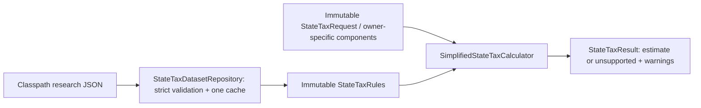

# Phase 6B — Standalone simplified state tax prototype

Completed October 8, 2026. This delivery implements an isolated **research calculator**,
not a replacement for the application's Michigan engine or a tax-return calculator.
Both supplied files were read completely, and the Phase 6A architecture report was
reviewed before implementation. The user's standalone Phase 6B scope supersedes
the Michigan-extraction roadmap suggested in that report.

## 1. Architecture summary

The smallest useful separation is four immutable/stateless domain types under
`com.daviddunn.retirementplanner.domain.tax.state.simplified`, plus a Jackson loader
in the existing `persistence` layer. There are no new dependencies or frameworks.
The live `domain.rules.FilingStatus` enum is reused; only SINGLE and
MARRIED_FILING_JOINTLY have supplied rules.

- `StateTaxRules`: normalized immutable records for brackets, deductions,
  treatment classifications, retirement adjustments, age/income bands, senior
  deductions, and surcharges. Nested collections are defensively copied.
- `StateTaxRequest`: immutable return participants and disjoint income components,
  with separately supplied federal bases, owner ages, gross/taxable Social Security,
  pension sources, qualifying events, and explicit qualification assessments.
- `StateTaxResult`: immutable detailed estimate, provenance, warnings and status.
  UNSUPPORTED has `Optional.empty()` for the entire estimate, never a fabricated zero.
- `SimplifiedStateTaxCalculator.calculate`: generic pipeline with request-local
  scratch amounts. No state-specific Java tax rates, bracket constants or code switches.
- `StateTaxDatasetRepository.load`: initialization-on-demand classpath cache.
  `parse(InputStream)` is the explicit fixture/import validation gate.

Existing `FederalTaxCalculation` supplies AGI/taxable-income/taxable-SS concepts,
but the prototype does not invoke or change federal taxation. It does not evolve
the dormant `StateIncomeTaxCalculator`, consume a mutable RetirementPlan, or change
the existing Michigan classes. The public standalone calculator loads only the
validated packaged catalog; it does not accept arbitrary unvalidated rule records.



There is deliberately no edge to ProjectionEngine, tax funding, Roth fill, UI,
plan repositories, analyzers or reports.

## 2. Exact supplied dataset structure and validation

Root fields: `schemaVersion`, `datasetVersion`, `taxYear`, `currency`, `model`,
`jurisdictions`. Accepted snapshot: schema `1.0-draft`, version
`2026-10-08-research-draft`, tax year 2026, USD, eight jurisdictions.

`model` contains name/purpose, FULL_YEAR_RESIDENT calculation basis, the two
supported statuses, jurisdiction count, override metadata, readiness policy and
excluded-feature list. Override metadata currently names
SIMPLIFIED_STATE_TAXABLE_INCOME; it is preserved, not silently reinterpreted.

Each jurisdiction contains code/name/type/year/readiness; taxBase; taxSystem
(NONE, FLAT rate, or PROGRESSIVE filing-status bracket lists, optional filing
threshold); deductions (status-specific standard deduction and personal
exemption amount/type/optional ceiling or NOT_MODELED phaseout); all eleven
incomeTreatment entries; retirementAdjustments; seniorAdjustments;
additionalTaxes; modeling declarations/limitations; publisher/source URL records.

Retirement descriptors contain id/type/scope/appliesTo, optional qualification,
eligibility (minimum age, events, age test, income basis), calculation
(method/cap/bands), optional pension sources, age bands, group, priority,
preventDoubleExclusion and limitations. Senior descriptors declare age/amount,
PER_PERSON DEDUCTION scope and optional exemption-ceiling reference. Surcharges
declare MARGINAL_SURCHARGE, STATE_TAXABLE_INCOME, status thresholds and rate.

Validation rejects unknown fields and rule identifiers/types, unknown income
references/sources/qualifications, duplicate JSON keys and rule/state identifiers,
trailing JSON, missing/null required values, unsupported years/currencies/statuses,
invalid rates/amounts, absent filing-status schedules, unordered/gapped/overlapping
brackets, missing unlimited final brackets, invalid age/income bands and references,
unsupported surcharge bases, contradictory no-tax records and extra standard
deductions on the federal-taxable-income base. Recognized optional fields have
explicit absence semantics; absent required deductions/rates are never zero.

Age bands cover consecutive **whole** ages from their declared eligibility floor
through an open final band. A fractional age in the 64–65 gap is unsupported rather
than silently rounded. Income bands are ordered and contiguous over their declared
range; lack of a band beyond that range is an unsupported calculation, not an
implicit zero exclusion. Exact shared endpoints are not silently assigned.

All eight records parse. Tests reject 41 malformed/unsupported mutations and
duplicate-key/trailing-document inputs. The packaged resource is byte-identical
to the supplied original, confirmed by a test and SHA-256:

`5A7918AB919B4D1E81FF4D1575B0F4C1C4D9A14E6A36E975F8B95ED8E9083734`.

## 3. Exact files created

1. `src/main/java/com/daviddunn/retirementplanner/domain/tax/state/simplified/StateTaxRules.java`
2. `src/main/java/com/daviddunn/retirementplanner/domain/tax/state/simplified/StateTaxRequest.java`
3. `src/main/java/com/daviddunn/retirementplanner/domain/tax/state/simplified/StateTaxResult.java`
4. `src/main/java/com/daviddunn/retirementplanner/domain/tax/state/simplified/SimplifiedStateTaxCalculator.java`
5. `src/main/java/com/daviddunn/retirementplanner/persistence/StateTaxDatasetRepository.java`
6. `src/main/resources/tax/state/state-tax-2026.json`
7. `src/test/java/com/daviddunn/retirementplanner/domain/tax/state/simplified/SimplifiedStateTaxCalculatorTest.java`
8. `src/test/java/com/daviddunn/retirementplanner/persistence/StateTaxDatasetRepositoryTest.java`
9. `PHASE-6B-SIMPLIFIED-STATE-TAX-PROTOTYPE.md`

The two root input files were supplied by the user, not created or edited by this
implementation. No pre-existing production, test, UI, plan JSON, rule JSON, build
configuration or Phase 6A report was modified. Maven logs are under `target`.

## 4. Supported methods

The declared methods implemented generically are:

- UNLIMITED_ELIGIBLE_INCOME, subject to declared qualification/source/age/events.
- CAPPED_ELIGIBLE_INCOME, using either scalar or status-specific caps.
- AGE_BAND_CAPPED_ELIGIBLE_INCOME, within specified age intervals.
- UNLIMITED_FEDERALLY_TAXABLE_SOCIAL_SECURITY, on federal-included SS only.
- STEPPED_INCOME_EXCLUSION, with CAPPED_ELIGIBLE_INCOME or
  PERCENT_OF_ELIGIBLE_INCOME bands inside the specified unambiguous range.
- HOUSEHOLD, PER_PERSON and HOUSEHOLD_WITH_QUALIFIED_PERSON_INCOME scopes.
- Priority ordering and tracking remaining amounts prevent double exclusion of
  the same income. A person's unused per-person cap never transfers to a spouse.
- Per-person senior deductions, exemption AGI ceilings, deduction/credit/NONE
  personal exemptions, flat/progressive/NONE tax, and marginal surcharge.
- State-defined filing threshold on total taxable-class income before deductions
  and retirement exclusions; threshold equality is exempt under the declared model.

Retirement qualification is not inferred from account type. Each income component
may explicitly assess a named dataset qualification as ELIGIBLE, INELIGIBLE or
UNKNOWN. Missing assessments needed for a positive eligible-category amount are
UNKNOWN and block calculation. Source-conditioned pension rules require a known
source. NY government income is processed before private capped income; consumed
income cannot be excluded twice.

## 5. Unsupported methods/scenarios and admission limits

Unknown methods or unsupported configuration types reject the entire dataset.
Known descriptors with insufficient scenario semantics return UNSUPPORTED:

- Colorado: the same owner has positive full-excludable SS and other pension/IRA/
  employer income in the shared group. The dataset does not encode how the SS
  subtraction consumes the pension cap; priority alone is insufficient. Separate
  owners do not automatically share that person's cap. SS-only and pension-only
  cases remain calculable, as do the declared capped under-65 cases with assessed
  qualifications. Fractional ages between the stated bands are unsupported.
- NJ: eligible retirement income with total income exactly 100,000, 125,000 or
  150,000, or above the final declared band. Interior bands are calculable;
  missing endpoint/out-of-range policy is not invented.
- State-defined bases: positive Roth conversions require separate basis/treatment
  review. An under-age or nonqualifying distribution covered by an unlimited
  retirement-exclusion rule requires early-distribution/basis review.
- Missing required retirement qualification or source information.
- Unknown jurisdiction, unavailable year or unsupported filing status.

The generic shared-group guard and state-defined admission checks identify these
conditions from descriptors and income types, not a switch on a state's code.
This avoids a schema redesign or state-specific tax implementation in this phase.

Negative income, losses, negative AGI and invalid/null amounts are outside the
request contract and fail input validation. Partial-year/nonresident cases, basis
ledgers, nonqualified Roth, municipal-source distinctions, inherited-pension
allocation, AMT, local taxes, itemizing and unlisted income categories are outside
this prototype. They must not be passed as ordinary supported income merely to
obtain an estimate. Declared omitted provisions remain explicit provisional-model
limitations rather than promises of legal accuracy.

## 6. Tax-base construction and request contract

`federalAgi` and `federalTaxableIncome` are supplied federal results. Classified
federal components are descriptive amounts already included in AGI, not additions
to it. Their sum cannot exceed AGI; the remaining AGI is ordinary income outside
the explicitly classified subset, not presumed retirement income. Federal taxable
income must be nonnegative and no greater than AGI in this supported envelope.
For STATE_DEFINED_INCOME, classified federal portions must reconcile to the entire
AGI: otherwise the scenario is UNSUPPORTED, since an unknown remainder cannot
silently disappear from the state base. State-basis amounts can still differ
from federal-included portions. Federal-excluded/state-taxable amounts also need
explicit lines; reconciliation cannot discover income unknown to both inputs.

Each return has a mandatory PRIMARY and, for MFJ, an actual SPOUSE. Both are
immutable owner-specific PersonIncome records. No placeholder spouse is made.
Each person supplies age, total gross SS, federally taxable SS, qualifying events
and income lines. Taxable SS must reconcile exactly to that person's SS lines and
cannot exceed gross SS. Gross SS itself is never subtracted from a federal base.

The eleven line categories are SS, traditional IRA, employer retirement plan,
pension, conversion, qualified Roth distribution, interest, ordinary dividends,
qualified dividends, short-term gains and long-term gains. Each line supplies:

- `federalIncluded`: the taxable portion already included in federal AGI, including
  only taxable SS; qualified Roth must have federalIncluded zero.
- `stateDefinedAmount`: an independently established state-basis component before
  retirement exclusions. The caller must establish taxable basis; the calculator
  cannot infer PA/NJ basis from federal AGI or gross withdrawals.
- PensionSource: PRIVATE, FEDERAL_GOVERNMENT, NEW_YORK_STATE_LOCAL_GOVERNMENT,
  OTHER_GOVERNMENT, UNKNOWN; qualifications and owner are retained independently.

IRA/employer lines **exclude conversions**. Ordinary dividend lines **exclude
qualified dividends**. A dollar is represented once; request validation catches
classified amounts exceeding AGI, but cannot prove that callers have classified
every dollar correctly. RMDs belong in the appropriate distribution category, not
an extra additive income line. No supported category is automatically invented
for omitted tax-exempt income.

| Base | Construction |
| --- | --- |
| FEDERAL_AGI_WITH_ADJUSTMENTS | Supplied AGI; remove only federal-included exempt components, then eligible exclusions/deductions. |
| FEDERAL_TAXABLE_INCOME_WITH_ADJUSTMENTS | Supplied federal taxable income; applicable component subtractions; no repeated federal standard deduction. |
| STATE_DEFINED_INCOME | Sum explicit stateDefinedAmount for TAXABLE-class components only; exempt SS/Roth never enter this sum; then declared exclusions/deductions. |
| NONE | Declared no-income-tax policy; zero liability is legitimate only for this validated policy. |

Ages and qualification assessments must be appropriate for the reported income.
The annual request cannot allocate receipts before/after a midyear eligibility
birthday. Supply only assessed qualifying income or defer such a scenario; the
prototype does not prove legal eligibility from an end-of-year age alone.

## 7. Calculation sequence and result details

1. Resolve jurisdiction/year/status, or return no-estimate UNSUPPORTED.
2. Construct the declared starting base and request-local remaining components.
3. Apply income-specific exemptions without subtracting federally excluded income.
4. Check ambiguous shared-cap scenarios; apply retirement rules by priority/scope.
5. Apply senior deductions and their declared exemption ceiling interaction.
6. Subtract standard deduction and personal exemption deductions; floor TI at zero.
7. Calculate flat/progressive tax; respect declared state-defined filing threshold.
8. Apply nonrefundable personal credits up to regular tax.
9. Add declared marginal surcharge on excess state taxable income.
10. Round final estimated liability to cents, HALF_UP; return provenance/status.

Intermediate BigDecimal arithmetic is exact: no floating-point money, no whole-dollar
return rounding, no rounding inside brackets, no tax-table interpolation. Detail
amounts retain calculation precision; only final estimated tax is rounded. Thus
displayed raw before-credit values may have fractions of a cent. This is an
intentional planning approximation, not a tax-return rounding claim.

Estimate includes starting base, income adjustment lines, retirement exclusion
lines, senior adjustment lines, standard deduction, personal exemption deduction,
taxable income, tax before credits, applied credits, additional taxes and final tax.
Every result also identifies jurisdiction/year/status/dataset version and warnings.
REVIEW_REQUIRED is always PROVISIONAL; it is never upgraded by arithmetic success.

## 8. Effective-rate override recommendation

No override API, UI or persistence was implemented. The immutable request/result
boundary can later accept an explicit calculation mode and named override base
without modifying the read-only table or the current prototype method.

Recommend a separate future `EFFECTIVE_RATE_OVERRIDE` policy with a plan-owned
rate and explicit **nonnegative federal AGI** base. It remains calculable even
when detailed state rules are unsupported. Label its result OVERRIDE, preserve
its selected base/rate, and never describe the rate as a true marginal rate.

| Override base | Advantages | Disadvantages |
| --- | --- | --- |
| Federal AGI | Stable supplied federal result; no successful state computation required; easy to explain/test. | Includes taxable SS in exempt states; ignores state deductions/exclusions; user must calibrate the effective rate to this exact base. |
| Simplified state AGI | Better state income exclusions than federal AGI. | Undefined for some state-defined regimes without adequate inputs; depends on rule completeness and cannot universally rescue unsupported calculations. |
| Simplified state taxable income | Matches the current dataset's documented suggestion; applies after state deductions/exclusions. | Cannot be computed reliably when those very rules are unsupported; rate calibration changes with the state model and year. |

This recommendation **differs from** the preserved dataset override-base descriptor.
It is not implemented or silently applied. A future approved API/schema decision
must resolve the difference explicitly. Do not reinterpret old inactive plan state
rate fields or use an override to infer a Roth marginal rate.

## 9. Eight-state arithmetic results and readiness

A = parsing, B = rule interpretation, C = arithmetic, D = independent tax-law
verification. A–C tests use explicit hand-computed expectations, not calls to the
calculator to generate expected values. One shared joint-income fixture supplies
60,000 AGI, 45,000 federal TI, ages 40/40 and 60,000 separately classified interest.
The state-defined bases use that explicit 60,000, not federal TI.

| State | Joint fixture estimated tax | Representative retirement fixture |
| --- | --- | --- |
| California | 418.88 | AGI 60,000, taxable SS 17,000: TI 37,100; tax 668.30. |
| Michigan | 2,048.50 | Single eligible IRA 80,000 + interest 20,000: cap 67,610; TI 26,490; tax 1,125.83. |
| Florida | 0.00 | Multiple single/joint incomes, including 2,000,000: zero personal income tax. |
| Illinois | 2,680.43 | Single age 65, eligible IRA 80,000 + interest 20,000: tax 795.71. |
| Pennsylvania | 1,842.00 | Explicit state IRA 70,000 at qualifying age + interest 10,000: tax 307.00. |
| New York | 2,040.80 | MFJ private incomes 50,000/5,000: owner exclusions 20,000/5,000; tax 544.05. |
| Colorado | 1,980.00 | Federal TI 60,000, qualified IRA 40,000, age 65: subtract 24,000; tax 1,584.00. |
| New Jersey | 1,001.00 | Single age 65 pension 80,000 + interest 30,000: exclusion 30,000; TI 78,000; tax 2,842.35. |

| State | Parses | Calculates | Independently Verified | Production Ready |
| --- | --- | --- | --- | --- |
| CA | Yes | Provisional supported scenarios | Partial: indexing/schedule cell and related guidance | No |
| MI | Yes | Provisional, assessed qualifying retirement only | Partial: 2026 rate, exemption, published caps | No |
| FL | Yes | Yes, declared no-personal-income-tax policy | Yes, narrow personal-income-tax scope | No application release/integration approval |
| IL | Yes | Provisional, assessed retirement eligibility | Partial: exemption/age/ceiling and retirement subtraction | No |
| PA | Yes | Provisional qualified-retirement/state-basis inputs | Partial: rate and eligibility guidance | No |
| NY | Yes | Provisional, known sources/qualifications | Partial: deductions and pension rules; full rate/recapture certification deferred | No |
| CO | Yes | Provisional; ambiguous shared-cap cases unsupported | Partial: federal TI base, rate/caps and interaction finding | No |
| NJ | Yes | Provisional band interiors; endpoints/out-of-range unsupported | Partial: exclusions, thresholds, exemptions; complete return verification deferred | No |

Florida's narrow tax-law claim is verified; even that is not authorization to
replace application services. Seven states remain research records, not certified
state calculators. No state is promoted to application production readiness.

## 10. Independent tax-law verification

Official sources accessed October 8, 2026. Tests tagged D are deliberately limited:
six Florida income/status combinations verify the no-personal-income-tax rule;
one California test checks a published 2026 regular-tax schedule cell. Other
fixtures are A–C arithmetic with independently researched provisions, not complete
tax-return golden certifications.

- **FL:** DOR confirms no personal income tax. No status/income-dependent bracket,
  exclusion or surcharge is required for this narrow estimate.
  [Florida DOR FAQ 1466](https://www.floridarevenue.com/faq/Pages/FAQDetails.aspx?FAQID=1466)
- **CA:** FTB's 2026 indexing publication corroborates 5,900/11,800 deductions,
  158/316 personal credits and a SINGLE regular-tax cell: taxable income 27,157
  gives 428.58 before credits. Complete annual information is announced for late
  December; its joint schedule has the previously audited printed subtraction-base
  inconsistency. Existing 2025 instructions identify exemption limitations, senior
  credits and the high-income tax, but do not certify complete 2026 treatment.
  The dataset omits senior credits as well as phaseout; high-income results can
  understate tax. No supplied values were replaced.
  [FTB 2026 indexing](https://www.ftb.ca.gov/about-ftb/newsroom/tax-news/),
  [2025 Form 540 instructions](https://www.ftb.ca.gov/forms/2025/2025-540-instructions.html)
- **MI:** Treasury's April 15, 2026 announcement verifies 4.25%; withholding guidance
  verifies the 5,900 exemption; ORS guidance publishes 67,610/135,220 retirement
  maxima. This does not establish every IRA/pension qualification or election.
  The prototype's caps differ from the live engine's 40,762/81,524 resource and
  are not substituted there. Special deductions/elections remain unmodeled.
  [2026 Michigan rate determination](https://www.michigan.gov/treasury/news/2026/04/15/state-individual-income-tax-rate-for-2026-tax-year-determined),
  [Michigan exemption guidance](https://www.michigan.gov/taxes/business-taxes/withholding/calendar-year-tax-information),
  [ORS Public Act 4 FAQ](https://www.michigan.gov/ors/public-act-4-of-2023-faq)
- **IL:** Official guidance verifies the 2026 2,925 exemption, additional 1,000 for
  age 65+, and federal AGI ceilings of 250,000/500,000. Retirement guidance
  subtracts qualifying federally included SS/retirement income. Conversion
  classification and special payment types still require review; this prototype
  follows the dataset's TAXABLE conversion treatment provisionally.
  [Illinois exemption allowance](https://tax.illinois.gov/questionsandanswers/answer.851.html),
  [Illinois retirement subtraction](https://tax.illinois.gov/individuals/pension.html)
- **PA:** Revenue guidance confirms 3.07%, eligible-plan/retirement conditions,
  59½/death/disability concepts and cost recovery for early distributions. The
  2026 estimated-tax instructions independently specify taxable income times
  .0307. They do not justify treating federal AGI as Pennsylvania income or
  assuming conversion basis; early/conversion scenarios remain unsupported.
  [PA retirement guidance](https://www.pa.gov/agencies/revenue/forms-and-publications/pa-personal-income-tax-guide/gross-compensation),
  [2026 PA estimated-tax instructions](https://www.pa.gov/content/dam/copapwp-pagov/en/revenue/documents/formsandpublications/formsforindividuals/pit/documents/2026/2026_rev-413i.pdf)
- **NY:** Official 2026 estimated-tax instructions verify 8,000/16,050 standard
  deductions and warn of separate high-income computations. Retiree guidance
  verifies the qualifying 20,000 per-person exclusion without spouse-cap transfer,
  eligible government pensions and midyear eligibility/beneficiary complications.
  Fiscal-year 2026 tax-expenditure material is not a complete tax-year 2026 return
  specification. The prototype preserves supplied brackets; high-income recapture
  is absent, so NY remains provisional rather than fully independently verified.
  [2026 NY estimated-tax instructions](https://www.tax.ny.gov/pdf/current_forms/it/it2105i.pdf),
  [NY retired-person guidance](https://www.tax.ny.gov/pit/file/information_for_seniors.htm)
- **CO:** January 2026 income-tax guidance addresses the federal-taxable-income
  base. DOR pension guidance states that the SS subtraction reduces the available
  other-pension subtraction. That interaction is not fully represented by group
  name/priority alone. The linked older Legislative Council page can contain an
  obsolete rate; it is not accepted as complete 2026 certification.
  [Colorado January 2026 income-tax guide](https://tax.colorado.gov/sites/tax/files/documents/Individual_Income_Tax_Guide_Jan_2026.pdf),
  [Colorado pension/SS guidance](https://tax.colorado.gov/sites/tax/files/documents/ITT_Social_Security_Pensions_and_Annuities_Jan_2025.pdf)
- **NJ:** Treasury guidance confirms age 62/disability qualification, qualified
  spouse income only, 75,000/100,000 caps, tier percentages and inclusive upper
  income thresholds. Its income-tax overview confirms 10,000/20,000 no-tax filing
  thresholds and per-person 1,000 basic/senior exemptions. Omitted other-retirement
  exclusion and basis interactions still prevent full verification. The calculator
  does not silently insert the official endpoint conventions into the dataset.
  [NJ retirement exclusions](https://www.nj.gov/treasury/taxation/njit7.shtml),
  [NJ income-tax overview](https://www.nj.gov/treasury/taxation/git_over.shtml)

Sources establish selected rules, not a blanket tax-law correctness claim. Final
2026 return forms, full eligibility envelopes and independent complete examples
are still needed before approving the seven review-required jurisdictions.

## 11. Dataset corrections/clarifications proposed, not applied

No numeric correction was made. Preserve the original hash and version. These
proposed JSON Patch fragments would require a reviewed subsequent schema/version
and corresponding loader/tests; **they are not accepted by this implementation**:

```json
[
  {"op":"add","path":"/jurisdictions/6/retirementAdjustments/0/sharedLimitConsumption",
   "value":{"group":"CO_PENSION_AND_SS","subtractPriorSocialSecurityExclusionFromCap":true}},
  {"op":"add","path":"/jurisdictions/7/retirementAdjustments/0/calculation/incomeBoundaryPolicy",
   "value":"FIRST_BAND_LOWER_INCLUSIVE_EACH_UPPER_INCLUSIVE_SUBSEQUENT_LOWER_EXCLUSIVE"},
  {"op":"add","path":"/jurisdictions/7/retirementAdjustments/0/calculation/aboveFinalBand",
   "value":"NO_EXCLUSION"}
]
```

The Colorado proposal follows DOR's cap-consumption statement; it needs worked
examples for SS exceeding the cap and mixed-owner returns. NJ's proposal follows
the official inclusive thresholds/above-150,000 ineligibility. Amount precision
around dollar boundaries also needs an explicit policy. Neither proposal changes
the existing dataset or live engine.

Additional review proposals: add CA senior-credit and phaseout descriptors using
final 2026 guidance; add NY high-income recapture or explicit supported-income
ceilings; explicitly model PA/NJ basis/early/conversion support envelopes; record
Colorado under-65 SS options and temporary-rate provenance; add disability eligibility
where necessary; separate tax-year versus fiscal-year source provenance. Do not
invent parameters where authoritative guidance has not yet been established.

## 12. Remaining modeling limitations

Full-year resident, 2026, SINGLE/MFJ, nonnegative component amounts only. No future
inflation projection or implicit year reuse. No municipal-source/basis/loss ledger,
complete investment-income generator, local taxes, dependency credits, itemizing,
AMT, return tax tables, special public/military benefits, disability deductions
outside declared events, inherited-benefit allocation or receipt-date qualification.
The calculator consumes assessed inputs; it does not create missing facts.

Colorado mixed SS/pension and NJ boundary/high-income cases intentionally have no
estimate. Declared omitted rules can materially affect other provisional results.
Reported tax is not a true marginal rate or an optimizer objective. The prototype
does not solve withdrawal/tax feedback or claim to be projection-ready.

## 13. Performance and concurrency observations

Default JSON parsing/validation happens once via JVM class initialization. All
calculator instances reuse the same immutable catalog. Import/fixture `parse`
intentionally parses each supplied stream; it is not a runtime tax-call path.
Calculation performs no network, file access, table parsing or shared mutation.

A test executes 200 identical requests on four worker threads and compares complete
results. Cache identity and nested collection immutability are tested. No result
cache, global current request or speculative optimization was introduced. Small
request-local component/line allocations remain; no large-scale speed claim is
made from this concurrency smoke test. Optimize only after correctness and an
approved integration workload are measured.

## 14. Verification and existing regressions

IntelliJ bundled Maven and the required project-local `.codex-m2/repository` were
used for every invocation. No existing expected financial values were edited.

- Compile: passed (`target/phase6b-compile.log`).
- Initial focused run: 91 tests, zero failures/errors/skips.
- Expanded focused suite: **105 tests** — 62 calculator/request/cache tests and
  43 dataset validation/resource preservation tests; zero failures/errors/skips.
- Focused plus existing tax/funding/Roth/single/couple/persistence regression run:
  **184 tests**, comprising 105 new and **79 existing**; zero failures/errors/skips
  (`target/phase6b-regression.log`).
- Full benchmark-inclusive suite after the final code changes: **1,923 tests**,
  **1,908 passed, 15 skipped**, zero failures/errors (`target/phase6b-full.log`).
  This includes the 105 prototype tests and **1,818 existing tests** (1,803 passed,
  15 skipped). A separate non-benchmark run was unnecessary after the full suite.
- Existing Michigan/federal/funding, RMD/Roth/Medicare, single-person/couple,
  deterministic/longevity-weighted, seeded Monte Carlo, golden, JSON and PDF/report
  expectations passed unchanged as part of that suite. This is regression evidence,
  not verification of integrating a new state into those services.
- `git diff --check`: passed. New untracked Java/report files were also checked
  for whitespace because plain git diff does not include untracked files.
- Resource hash and byte-comparison test confirm supplied dataset preservation.

Existing application financial values and algorithms did not change. The isolated
prototype can produce different Michigan estimates because its supplied research
rules differ; it is never called by the application. Nothing was staged, committed
or pushed.

## 15. Recommended next phase and approval boundary

First approve a **dataset clarification and tax-law fixture phase**, still isolated:
resolve Colorado shared-cap consumption and age definitions, NJ boundary/out-of-range
policies, CA omitted credits/phaseout, NY recapture, and retirement conversion/basis
envelopes. Version any approved patches and retain the original artifact/hash.
Add complete official examples and admission tests before promoting readiness.

Then obtain separate approval for integration design: explicit mode/override base,
legacy Michigan preservation, owner-specific income adapters, projected-year policy,
cash-funding/Roth iteration tests, state-aware results and eventual UI/persistence.
Do not integrate this prototype by merely replacing MichiganTaxCalculator. The
Phase 6A feedback-loop and missing-income findings still apply.

**Implementation and verification are complete for this standalone Phase 6B
prototype. Stop and await approval before any retirement-projection integration.**
